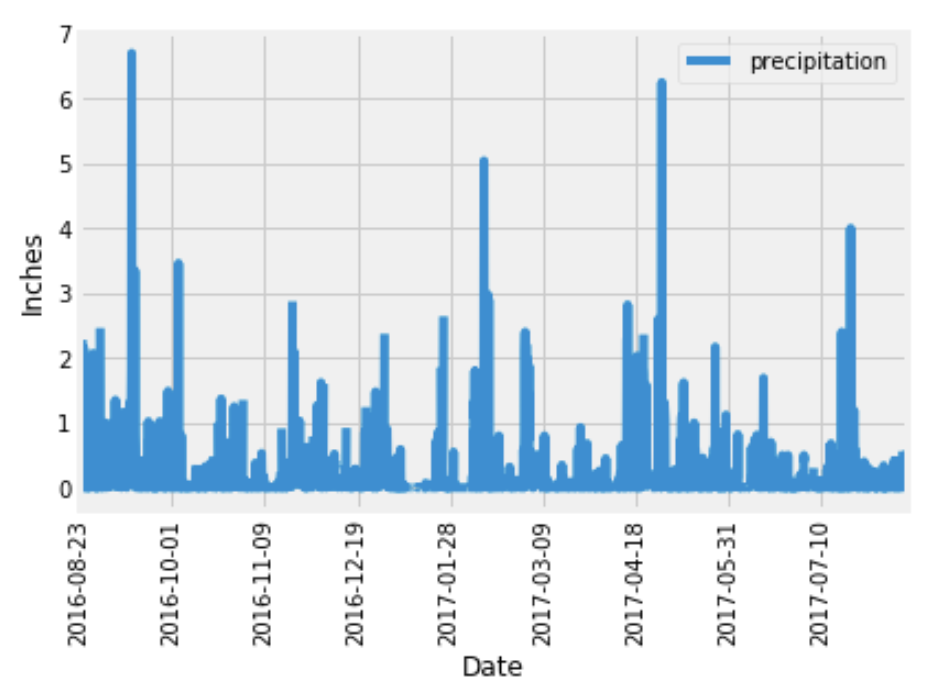

## Summary

Weather is an important factor to take in account prior to any vacation. It is importamt to gage what the weather will be like when you are at your destination site, and that is what makes analysis of previous weather data so important. With this, you can have a better understanding of what the weather will be like during a given time. With the use of Jupyter Notebook, SQLAlchemy, and Flask, we can evaluate the precipitation data for further analysis.

## Scope

Our database includes two tables, precipitation measurement data and station data. I used Jupyter Notebook to perform the intial analysis on the precipitation and station data. First, I used SQLAlchemy to create an enginge to create a connection the Hawaii database, and used Python to create a few plots.

Similarly, I did the same when I created a Flask app that had precipitation measurement and station information. I created a route for each that returned the data in a JSON format. I also created a route that had the information in JSON format for a specific start date, and another that could also take in a specific end date.
